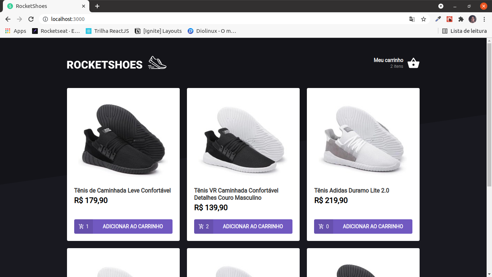
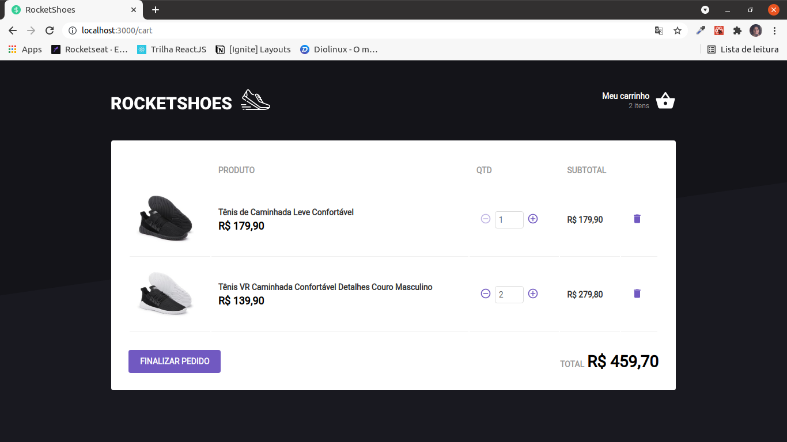

<h1 align="center" style="background-color: black">
  
</h1>

## Introdução
Um projeto de carrinho de compras para um E-Commerce.
## Primeiro Acesso
### Clonando o projeto
```
$ git clone https://github.com/matheusfd3/shopping-cart.git
```
### Baixando as dependências
Na pasta do projeto execute o comando abaixo com o [Yarn](https://yarnpkg.com/lang/pt-br/).
```
$ yarn install
```
### Fake API com JSON Server
Vamos utilizar o JSON Server para simular uma API que possui as informações dos produtos e do estoque.
```
$ yarn server
```
### Rodando no localhost
```
$ yarn start
```
Acesse [http://localhost:3000/](http://localhost:3000/).
## Páginas
### **Rocketshoes**
<h2 align="center">
  
</h2>

### **Meu Carrinho**
<h2 align="center">
  
</h2>
